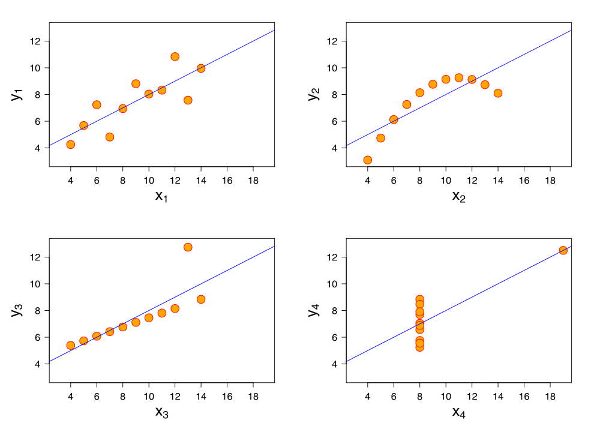

# mean

## Average, Above Average, Below Average

* Why (When) do we care about the mean?
	- Sorting is $O(n\,log\,n)$
	- When data are symmetrically distributed around it
	- When lots of points are close to it

* How far away is a point from the mean?
	- $(x - \bar{x})$

* How far away from the mean are points on average?
	- Let's say there are $n$ points
	- If we just care about the distance, not direction
	- $\frac{\Sigma_1^n (x - \bar{x})^2}{n}$

## Far From the Mean

* But why squares?
	- Add 2 units to 2, 12 units to 4. Why?

* Ok. We will take a square root.
	- $\sqrt{\frac{\Sigma_1^n (x - \bar{x})^2}{n}}$

* Square root of sum of squares and absolute values

	
	```r
		sqrt(sum((seq(1, 5, 1) - 3)^2)/5)
	```
	
	```
	## [1] 1.414214
	```
	
	```r
		sum(abs(seq(1, 5, 1) - 3)/5)
	```
	
	```
	## [1] 1.2
	```

# go together

## Meaning

* When $x$ is large, is $y$ large too?
	- What does that mean?

* When $x$ is 1, is $y$ more likely to be 1 than when $x$ is 0?

* As $x$ increases, does $y$ increase too?
	- On average

* How do you capture that intuition?

* Rank $x$s and $y$s
	- Kendall --- concordant pairs
	- Spearman --- Diff. in ranks
 
## Intuitions we understand

* When $x$ is above average, $y$ is above average
	- Dichotomize. Quadrant Count Ratio.

* Proportion of local changes that are in the same direction
	
	```r
		x = c(100, 200, 300, 400, 500, 600)
		y = c(1, 2, 3, 4, 5, -17000)
		mean(diff(x) > 0 & diff(y) > 0)
	```
	
	```
	## [1] 0.8
	```

* Average of local changes
	
	```r
		x = c(100, 200, 300, 400, 500, 600)
		y = c(1, 2, 3, 4, 5, -17000)
		mean(c(1/100, 1/100, 1/100, 1/100, -17001/100))
	```
	
	```
	## [1] -33.994
	```

## Correlation 

* For each $x$, $y$, calculate how far it is from its mean

* Then multiply:
	- $\Sigma_1^n (x - \bar{x}) (y - \bar{y})$
	- If you are below the mean, I am below the mean, a positive number

* Let's try this out. 
	- 100, 200, 300, 400, 500
	- 1, 2, 3, 4, 5

*	
	
	```r
	  x = seq(100, 500, 100) - 300
	      y = seq(1, 5, 1) - 3
	      sum(x*y)
	```
	
	```
	## [1] 1000
	```

* What do you do with that?

## Normalization

* Normalizing constant
	- $\sqrt{\Sigma_1^n (x - \bar{x})^2 \Sigma_1^n (y - \bar{y})^2}$
	- Converting $x$ and $y$ into $z$ scores
	-  
		
		```r
			  	x = sum((seq(100, 500, 100) - 300)^2)
		      	y = sum((seq(1, 5, 1) - 3)^2)
		      	sqrt(x*y)
		```
		
		```
		## [1] 1000
		```

* What if we subtract 100 and 1?

	
	```r
	  x = seq(100, 500, 100) - 100
	      y = seq(1, 5, 1) - 1
	      sum(x*y)
	```
	
	```
	## [1] 3000
	```

	
	```r
	  	x = sum((seq(100, 500, 100) - 100)^2)
	      	y = sum((seq(1, 5, 1) - 1)^2)
	      	sqrt(x*y)
	```
	
	```
	## [1] 3000
	```

## Linear Relation

* Let's add a big jump
	
	```r
		x = c(100, 200, 300, 400, 500, 600)
		y = c(1, 2, 3, 4, 5, 17000)
		cor(x[1:5], y[1:5])
	```
	
	```
	## [1] 1
	```
	
	```r
		cor(x, y)
	```
	
	```
	## [1] 0.6548077
	```

* Same order?
	
	```r
	 cor(x, y, method = "spearman")
	```
	
	```
	## [1] 1
	```

## Linear Relation

* Let's add a big drop
	
	```r
		x = c(100, 200, 300, 400, 500, 600)
		y = c(1, 2, 3, 4, 5, -17000)
		cor(x, y)
	```
	
	```
	## [1] -0.6544996
	```

* Same order?
	
	```r
	 cor(x, y, method = "spearman")
	```
	
	```
	## [1] 0.1428571
	```

## Anscombe's Quartet



