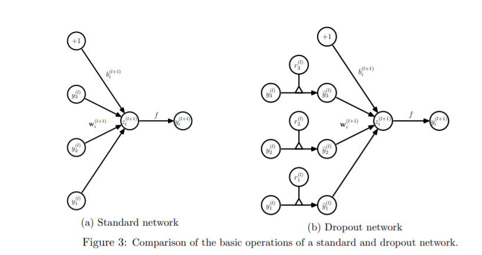
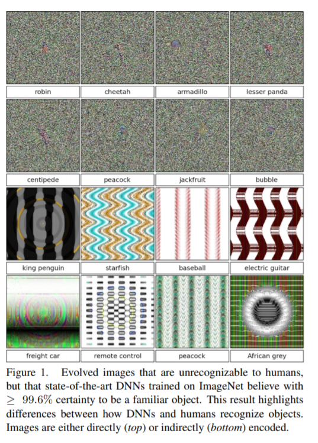
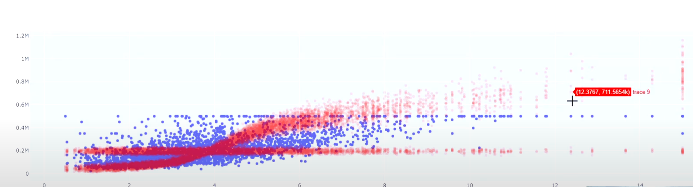

## Bias, Variance, and Error

* $Bias = E[\hat{f}(x) - f(x)]$

* $Variance = E[\hat{f}(x)^2] - (E[\hat{f}(x)])^2$

* $Error  = E[(y - \hat{f}(x))^2]$

* $E[(f(x)  + \epsilon - \hat{f}(x))^2]$

* $E[f(x) + \epsilon + E[\hat{f}(x)] - E[\hat{f}(x)] - \hat{f}(x))^2]$

* $(a + b + c)^2 = a^2 + b^2 + c^2 - 2ab - 2ac - 2bc$

* Expectation of sums is sum of expectations

* $E[(f(x) - E[\hat{f}(x)])^2] + E[\epsilon^2] + E[(E[\hat{f}(x)] - \hat{f}(x))^2] + \\
  2*E[(f(x) - E[\hat{f}(x)])]*E(\epsilon) + 2*E[(E[\hat{f}(x)] - \hat{f}(x))]*E[\epsilon] + \\
  2*E[(f(x) - E[\hat{f}(x)])]*E[(E[\hat{f}(x)] - \hat{f}(x))]$

## Continued ...

* $Bias^2 + Var(y) + Variance$

* $Bias^2 + \sigma^2 + Variance$

## Bias/Variance Tradeoff

* kNN

  $E[(y- \hat{f}(x))^2| X=x]= (f(x) - \frac{1}{k} \sum_{i=1}^{k} f(N_{i}(x)))^{2} + \frac{\sigma^{2}}{k} + \sigma^{2}$

  where $N_1(x), ..., N_k(x)$ are the k-nearest neighbors of $x$ in the training set.

* Regression methods
    - Penalize large $\theta$s
    - Penalize squiggliness

* How to think?
  * Priors on $\theta$s, squiggliness, etc.
  * Constrained optimization

* Methods
  * Change the cost function
  * Add priors to thetas
  * [Add noise](https://direct.mit.edu/neco/article/7/1/108/5828/Training-with-Noise-is-Equivalent-to-Tikhonov)
  * Model averaging
  * Constrain weights---max-norm

## Cubic Spline Smoothing

* Spline = A $k$th order spline is a piecewise polynomial function of degree $k$, that is continuous and has continuous derivatives of orders $1, . . . k − 1$, at its knot points

* Second derivative = curvature
  - Integrate over the second derivative (squared)

* Math
  * $Log(L) - \lambda * W$
  * $\Sigma_{i = 1}^n (y_i - f(x_i))^2 + \lambda \int (f^{''}(x))^2 dx$

## Dropout

* Feed forward operation of standard NN for $l \in \{0, ..., L-1\}$ and hidden unit $i$ where $f$ is any activation function

  $z_i^{(l + 1)} = w_i^{(l + 1)} y^l + b_i^{(l + 1)}$ 
  $y_i^{(l + 1)} = f(z_i^{(l + 1)})$

* With Dropout:

  $r_j^{(l)} \sim \text{Bernoulli}(p)$ 
  $\tilde{y}^{(l)} = r^{(l)}*y^{(l)}$ 
  $z_i^{(l + 1)} = w_i^{(l + 1)} \tilde{y}^{(l)} + b_i^{(l + 1)}$ 
  $y_i^{(l + 1)} = f(z_i^{(l + 1)})$

* [Inverted Dropout](https://stats.stackexchange.com/questions/241645/how-to-explain-dropout-regularization-in-simple-terms/241668#241668)

* Backward propagation

## Dropout 

## Dropout

* Heuristic understanding
  * Prevents network from co-adapting too much
  * Averaging over many models
    * Each model for a new batch
    * But weights each model equally

* Mathematical understanding
  * Gal and Ghahramani (2016)
  * Dropout as a Bayesian Approximation of a well-known probabilistic model: the Gaussian process

## More Dropout

* Practical issues
  * Optimal retention rates for input .8, .5 for hidden
  * Pair with max norm regularization
    * constrain the $L_2$ norm of the weight for each hidden unit to $c$
  * Prediction
    * If a unit is retained with probability $p$ during training, the outgoing weights of that unit are multiplied by $p$ at test time.

## The Importance of Being Uncertain

* Deep networks can be easily fooled

  

* Tesla

## How?

* Using Dropout to Estimate Uncertainty
  * Monte Carlo Dropout: pass same input in test multiple time and you get diff. output

## Figure

## Batch Normalization

- Train time
  + Normalize

- Test time
  - Single example at a time
  - Exponentially Weighted average 

## Benefits of Batch Normalization

* Benefits?
  - Robust to shifting input distribution?
    - Not true: https://arxiv.org/abs/1805.11604
  
  - Regularization?
    - Not really
    - Adds noise because mean and variance are calculated with error
    - if you use large mini-batch -> you reduce regularizer 
  
  - Optimization landscape significantly smoother. 
    - This smoothness induces a more predictive and stable behavior of the gradients, allowing for faster training.
    - Similar to benefits of normalizing input units
