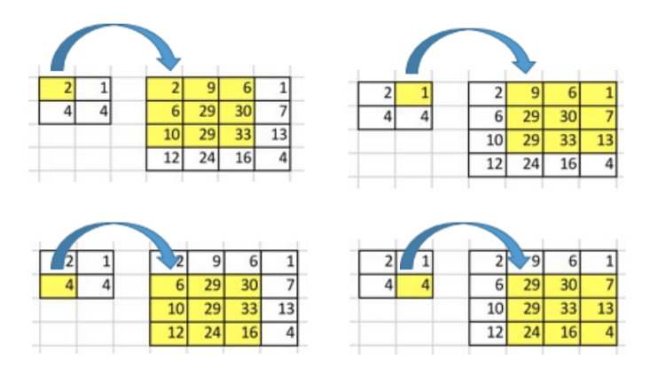
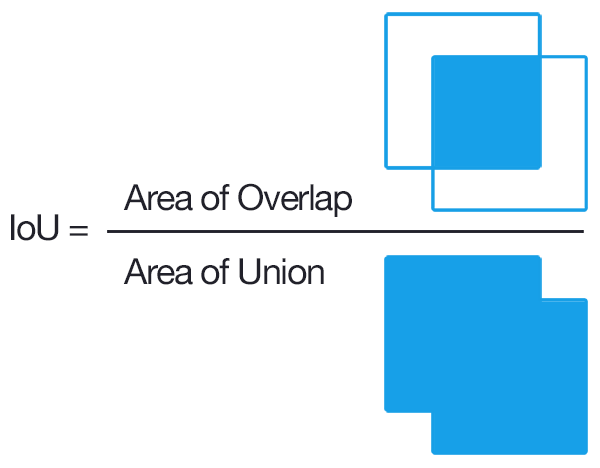

## Building Blocks and Main Varietals

* Building Blocks 
  * Convolutions (Filters)
  * Pooling
  * Upsampling
  * Selective search

* Main Varietals
  * Object Detection
  * Image Segmentation
  * Instance Segmentation

## Object Detection

## Semantic Segmentation

## Instance Segmentation

## Why Do Instance Segmentation?

* Tesla: is the car ahead of me breaking?
  * To answer that, you need to track the car so that you can estimate change in speed
      * If you lose which car, your estimate of change in speed would be garbled 
  * One of the reasons why Tesla stepped away from radars

## A Brief Aside: How to build generalizable models?

* Classification
  * Inter-class variation
    * Cat images, Dog images
  * Intra-class variation:
      * How many different types of cats exist
  * Lots of diff. classes
    * It forces the ML algorithm to not learn from shallow features

## Loss Function for Object Detection

* Localization Loss
  * Bounding box
  * (x, y), width, height 
  * Measured w.r.t. top left
  * Loss function:
      * $(x - \hat{x})^2$, $(y - \hat{y})^2$
      * $(\sqrt{w} - \sqrt{\hat{w}})^2$ (YOLO)
        * to classify smaller objects better 

* Classification Loss

* Net Loss
  * Localization Loss + Classification Loss
  * You can weight the losses

## [YOLO Loss Function](https://www.cv-foundation.org/openaccess/content_cvpr_2016/papers/Redmon_You_Only_Look_CVPR_2016_paper.pdf)

\begin{align*}
\mathcal{L} &= \mathcal{L}_\text{loc} + \mathcal{L}_\text{cls} \\
\mathcal{L}_\text{loc} &= \lambda_\text{coord} \sum_{i=0}^{S^2} \sum_{j=0}^B \mathbb{1}_{ij}^\text{obj} [(x_i - \hat{x}_i)^2 + (y_i - \hat{y}_i)^2 + (\sqrt{w_i} - \sqrt{\hat{w}_i})^2 + (\sqrt{h_i} - \sqrt{\hat{h}_i})^2 ] \\
\mathcal{L}_\text{cls}  &= \sum_{i=0}^{S^2} \sum_{j=0}^B \big( \mathbb{1}_{ij}^\text{obj} + \lambda_\text{noobj} (1 - \mathbb{1}_{ij}^\text{obj})\big) (C_{ij} - \hat{C}_{ij})^2 + \sum_{i=0}^{S^2} \sum_{c \in \mathcal{C}} \mathbb{1}_i^\text{obj} (p_i(c) - \hat{p}_i(c))^2
\end{align*}

## Segmenting Images

## Filters

Sharpen filter 
$$
\begin{bmatrix}\ \ 0&-1&\ \ 0\\-1&\ \ 5&-1\\\ \ 0&-1&\ \ 0\end{bmatrix}
\begin{bmatrix}
\ \ 0 & -1 & \ \ 0 \\
-1 & \ \ 5 & -1 \\
\ \ 0 & -1 & \ \ 0
\end{bmatrix}
$$

## Convolutions

Sum of element-wise product between the input matrix and kernel matrix

## 

{width=80%}

## (Max) Pooling

* Backward pass?

## Backward pass

## Upsampling

* Nearest neighbor interpolation
* Bi-linear interpolation, etc.
  
  \begin{align}
  f(x,y_{1}) \approx \frac{x_{2}-x}{x_{2}-x_{1}} f(Q_{11}) + \frac{x-x_{1}}{x_{2}-x_{1}} f(Q_{21})\\
  f(x,y_{2}) \approx \frac{x_{2}-x}{x_{2}-x_{1}} f(Q_{12}) + \frac{x-x_{1}}{x_{2}-x_{1}} f(Q_{22})
  \end{align}

  Next, interpolate in the y-direction:

  \begin{align}
   f(x,y) \approx \frac{y_{2}-y}{y_{2}-y_{1}} f(x,y_{1}) + \frac {y-y_{1}}{y_{2}-y_{1}} f(x,y_{2})
   \end{align}

## Transposed Convolution

## Evaluation Criteria

## Thresholding IoU

## Mean Average Precision

* Compute PR curve for each class
* For given recall, estimate precision
* Average over classes
* 0 to 100
 
## Segmenting Images

* Image as graph:
  * pixel = vertex
  * edge = connection between neighboring pixels
    - 8 other pixels at max
    - weight = dissimilarity between the pixels

* Measuring Distances
  * Internal Difference: $Int(C) = \max_{e\in MST(C, E)} w(e)$
  * Difference between two components: $Dif(C_1, C_2) = \min_{v_i \in C_1, v_j \in C_2, (v_i, v_j) \in E} w(v_i, v_j)$
  * Minimum internal difference: $M Int(C1,C2)=min(Int(C_1)+\tau(C1),Int(C2)+\tau(C2))$ where 
    $\tau(C) = k / \vert C \vert$

## Segmenting Images (Contd.)

* Segmentation
  * Partition vertices into multiple connected components
  * Good segment if 
    $D(C_1, C_2) = 
    \begin{cases}
      \text{True} & \text{ if } Dif(C_1, C_2) > MInt(C_1, C_2) \\
      \text{False} & \text{ otherwise}
    \end{cases}$

* [Felzenszwalb's Algorithm](http://fcv2011.ulsan.ac.kr/files/announcement/413/IJCV(2004)%20Efficient%20Graph-Based%20Image%20Segmentation.pdf)
  * Sort edges by weight in ascending order
  * Start with n components
  * Pick the kth edge
  * If the vertices at the ends of the edge are in the same component, do nothing
  * If they are different, merge if $w(v_i, v_j) \leq MInt(C_i^{k-1}, C_j^{k-1})$

## Selective Search

1. Segment images

2. Greedily group regions together till all image is one region
    * Calculate similarity with neighbors
    * Combine with the most similar region
    * Calculate new similarity scores 

3. Practical stuff:
  * Define similarity via color, texture, shape, etc. 
  * Bias for merging smaller regions first.
