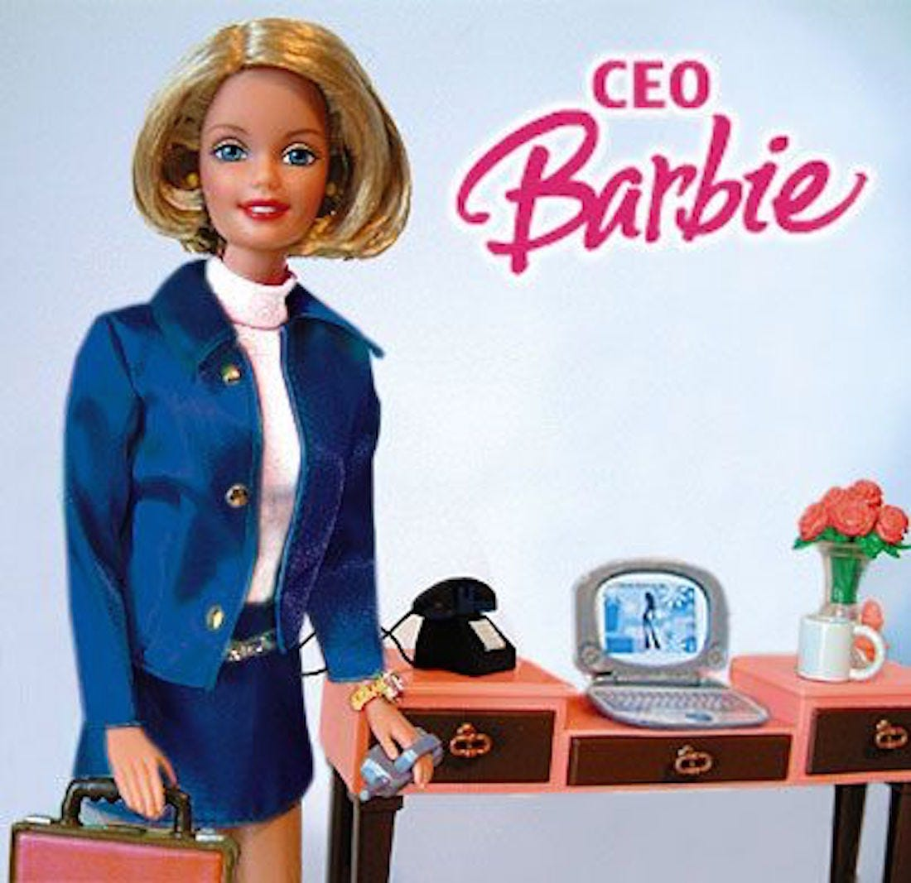

# ethical ml

## Concerns

* Solving bad problems with ML
  - DeepNude: Using DL to undress women
  - ML for password cracking

* Standard ML being used for bad aims
  - Face ID for finding political opponents

* Harm from violating privacy
  * Share data on health, etc., which may be used to discriminate 
  * Inadvertent disclosures due to poor security

* Representational Harm
  - [CEO Barbie](https://www.washingtonpost.com/news/wonk/wp/2015/04/14/what-one-simple-google-search-tells-us-about-how-we-view-working-women/)

## CEO Barbie

{width=40%}

* only 11% of the Google image results for CEO showed women (vs. 27% female CEOs in the US)
* [Unequal Representation and Gender Stereotypes in Image Search Results for Occupations](https://dl.acm.org/doi/abs/10.1145/2702123.2702520) (Kay, Matuszek, and Munson 2015)

## Taxonomy

* Unfair allocations
  - Interview panel has been making decisions about who gets in based on whether the person plays lacrosse
    - crack team of ML algo. people learn a model

* [Taxonomy](https://www.youtube.com/watch?v=fMym_BKWQzk) (Crawford NeurIPS, 2017; Barocas et al. 2017)
  - Representational Harm
  - Allocative Harm
  
## Underlying Reasons 

* The lay data used to train is biased
  - CEO Barbie
    + captures societal biases
  - Hiring

* Majority class errors matter more
  - Model fits majority class better

* Intrinsic differences across groups?
  - Women recidivate at lower rates than men

## What's Fair?

* Fairness:
  * Who gets a loan and who doesn't
  * When the classifier is 100% accurate (w.r.t the true label), end discussion of fairness
  * Misclassifications

## Group Fairness

* Group Fairness
  * Equally accurate across groups
    - FPR, etc. 
      - per 100 people of group X, we make 10 errors
      - per 100 people of group Y, we make 10 errors 
  * When the classifier is a random coin toss (or 100% accurate), end discussion of fairness

* Concerns
  * Measurement
    + Which groups?
    + How do we measure who belongs to which group?

## Solutions

* Anti-classification
  - Do not use 'sensitive' data (group information)

* Classification Parity
  * via constrained optimization
    - constraint: group error rates are the same
    - When we are doing param. search, our search space is restricted
    - satisficing vs. optimizing metric
        - constraint = satisficing metric
  * via multi-objective optimization
    - pareto frontier
      - solution space where you cannot improve on one objective (fairness) without compromising another
  * Increase the class weight of the underrepresented classes
  * Train separate models for different groups

## Trade-offs
  
* Loan classification (who gets a loan and who doesn't):
  * all groups ~ equalize error rates
  * accuracy vs. fairness
    * group_x is the one we want to protect
      * unfair:
        * group_x, per 100, 10 errors
        * group_y, per 100, 5 errors
      * fair:
        * group_x, per 100, 20 errors
        * group_y, per 100, 20 errors

## Lender's perspective

* Less accurate model -> interest rates are going to be higher
  * unfair:
    * group_x, per 100, 10%
    * group_y, per 100, 5%
    * 
  * fair:
    * group_x, per 100, 15% -> fewer members of group_x will get a loan, or they will pay a higher interest rate for the same loan
    * group_y, per 100, 15%

* Equilibrium
  * We can give more loans at time 1 but unequal outcomes may mean larger adjustment

## Uncertain

* Discriminating against people where we are most uncertain
  * wider confidence bands for members in group x vs. group y on average
  * wide confidence bands mean
    * point estimate of a person's prob. of paying back the loan is not a good estimate
      * we don't actually know whether the person pay back the loan or not

* Solution
  * if confidence_bands are big:
    * collect more data or compensate in another way 
