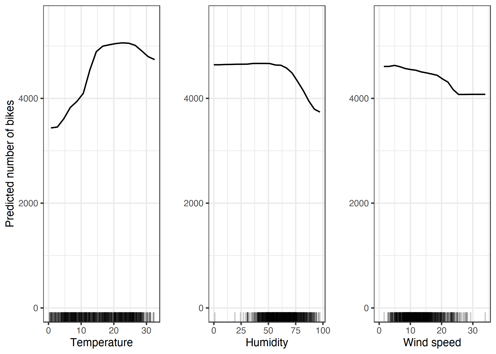
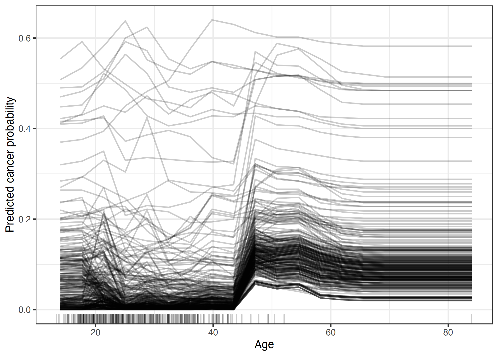
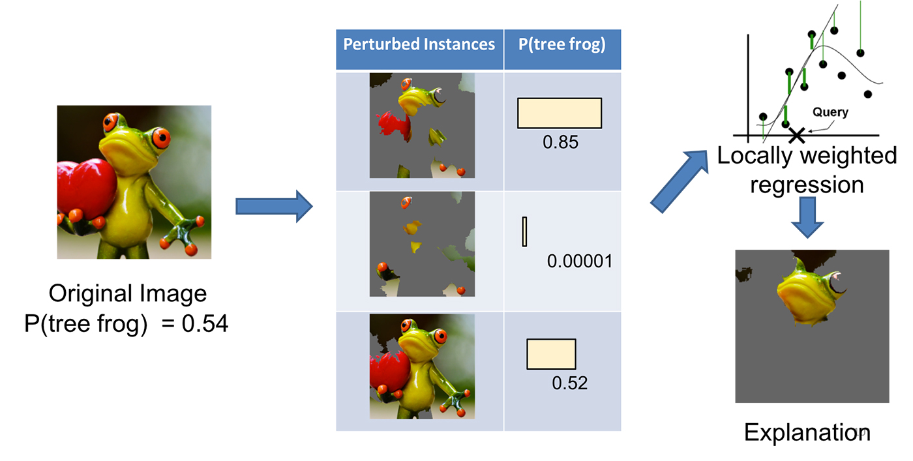
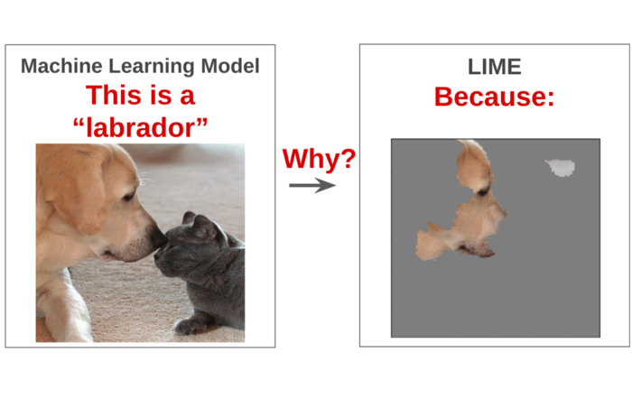

## What's Interpretable ML?

* Interpretability is the **degree to which** a human can:

    * understand the **cause** of a decision. 

    * consistently **predict** a model's result.

    * Source: [Interpretable ML](https://christophm.github.io/interpretable-ml-book/interpretability-importance.html) (which quotes from other papers)

* What Doesn't Work
    * Can't be 'degree to which'
    * Performance may vary across humans.
    * Assume no loss of information during communication.

* **How** did the model make a prediction?

## Why Interpret?

1. Debugging
    - e.g., finding confounding variables
    - detecting bias

2. Building Robust Systems
    - e.g., ``An explanation might reveal that the most important learned feature is to recognize the two wheels of a bicycle, and this explanation helps you think about edge cases like bicycles with side bags that partially cover the wheels.'' from [IML](https://christophm.github.io/interpretable-ml-book/interpretability-importance.html)

2. Communication
    - if your mom puts your favorite dish in front of you, you don't ask why
    - may increase persuasion
    - doesn't have to be correct interpretation
    - how we communicate may matter

## Interpretation

* Relationship between feature and y

* How important is a feature?

* Local:
    - compare to similar 'rows'
    - define what's local
    - *ceteris paribus*

## Three Notions of Feature Importance

via [Jiang and Owen](https://statweb.stanford.edu/~owen/reports/qregvis.pdf)

* Causality: How much does x cause y?

* OOS Accuracy: How much do OOS preds improve when you add x?

* $\beta$ (with normalization) or ANOVA

## OOS Accuracy Using Permutation

* Feature importance = increase in the model's prediction error after permuting the feature. From IML:

    1. Estimate the original model error $e_\text{orig} = L(y, f(X))$ (e.g. mean squared error). 
    
    2. For each feature $j = 1,...,p$:
    
        1. Generate feature matrix $X_\text{perm}$ by permuting feature $j$ in the data $X$. This breaks the association between feature $j$ and true outcome y.
        
        2. Estimate error $e_\text{perm}= L(Y,f(Xperm))$ based on the predictions of the permuted data.
        
        3. Calculate permutation feature importance $FI_j= \frac{e_{\text{perm}}}{e_\text{orig}}$. Alternatively, the difference can be used: $FI_j = e_{\text{perm}} - e_{\text{orig}}$
        
        4. Sort features by descending FI.

## OOS Accuracy

1. Add/Remove features and see what happens to prediction
    * Backward and forward stepwise regression

2. Concern: Adding a correlated feature can decrease the importance of the associated feature by splitting the importance between both features.

## Relationship Between Feature(s) and Y

* Partial Dependence Plots (PDP)

    * Zhao and Hastie point to [Friedman, 2001](https://projecteuclid.org/journals/annals-of-statistics/volume-29/issue-5/Greedy-function-approximation-A-gradient-boosting-machine/10.1214/aos/1013203451.full). 
    
    * Let $x_S$ be the features we want to interpret
    
    * Let $x_C$ be all the other features used in the model $\hat{f}$
    
    * The average marginal effect of $x_S$ on prediction
    
    * $\hat{f}_{x_S}(x_S) = \frac{1}{n}\sum_{i=1}^n\hat{f}(x_S,x^{(i)}_{C})$
        * where $n$ is the number of rows
        * say $x_s$ is temperature. iterate over each temperature value, setting $x_s$ to that value and averaging over predictions

## PDP

* Bike Rentals on 1st day (from D.C. Bikeshare data; from [IML](https://christophm.github.io/interpretable-ml-book/interpretability-importance.html)) 
    

* Issues
    * If $x_S$ is correlated with $x_C$, we may end up drawing values of $x_S$ that are imaginary.
    * Eliding over 'interactions'

## Individual Conditional Expectation (ICE)

* [Goldstein et al. 2013](https://arxiv.org/abs/1309.6392)
* Simulate how an instance's prediction changes when a feature value changes.
    - PDP is the average of the lines of an ICE plot
    - Keep all other features the same but iterate over one feature
*  
    

## Accumulated Local Effects (ALE) Plot

## Surrogacy

* Global surrogate: Using a simpler model to predict outcomes of a 'black box model'

* Local surrogate/LIME [Ribeiro et al. 2016](https://arxiv.org/abs/1602.04938). Via IML:
    - Select the instance of interest for which you want to explain the prediction.
    - Perturb the dataset and get the black box predictions for these new points.
    - Weight the new samples according to their proximity to the instance of interest.
    - Train a weighted, interpretable model on the dataset with the variations.
    - Explain the prediction by interpreting the local model.

## LIME Contd.

* Text, Images:
    - Randomly remove words
    - Images: randomly block out superpixels

* Lime Workflow 
    

## LIME Explanation

* Perturb the image, predict, estimate locally weighted regression—-we care more about making mistakes in perturbed instances that are more similar to the original image. 
* Present the superpixels with highest positive weights as an explanation, graying out everything else

*  
    

## LIME

* Use Lasso or super short trees

* Issues:
    - Defining neighborhood
    - Instability. Perturb again and get a different explanation.
