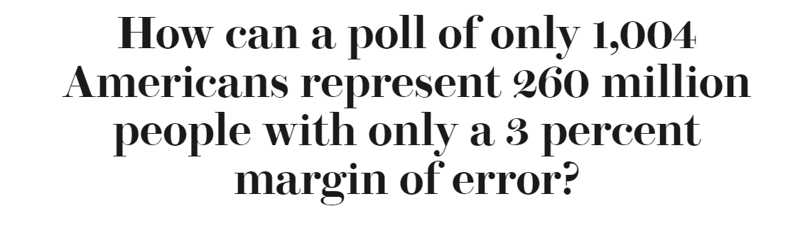

# Power Tools

## Think About Numbers

## Law of Large Numbers

* Life before Big Query

* How did we know?

##

##

## Magic

* Random sample
	- 100 people
	- another 100 people 
	- chances are the means are very different
	- how about 1000 people?
	- less different
	- means of these samples are normally distributed with standard deviation of:
		+ $\sqrt \frac{p*(1 -p)}{n}$
		+ maximize this given $n$
		+ also called the standard error

##

<iframe width="423" height="751" src="https://www.youtube.com/embed/Kq7e6cj2nDw" title="YouTube video player" frameborder="0" allow="accelerometer; autoplay; clipboard-write; encrypted-media; gyroscope; picture-in-picture" allowfullscreen></iframe>

## MECE

* Management consultants swear by it, so it can't be a good idea. Right?
* Mutually Exclusive, Comprehensively Exhaustive
* Sample Failures
	* Assign 'type' of failure

## Doordash

* Say that they are having trouble giving good ETAs
	- Pre-pickup
		- cooking times
	- Post-pickup
		- 5 miles
			- average error +/- 30 minutes
				- when you have good location data
					- your estimates are still bad
					- under good conditions, how often do you fail?
						- dasher is close
						- dasher has good location data
						- what's the excuse?

## Systemic Thinking

* Sources of the problem
	- Meta failure
	- Localized failure
		+ Browser
		+ OS

## Exploit the Skew

* There would be no startups if:
	- each problem = lots of small ROI issues

* Pareto distribution
	- 80--20 rule
	- Relative survival depends only on $\frac{x1}{x2}$
	- If the top 20\% of people receive 80\% of income then the top 4\% (20\% of 20\%) receive \ldots
	- At nearly each stage of problem solving, asymmetric returns

## Dr. House

* Differential Diagnosis
* Do something
	- If it fixes things...

 