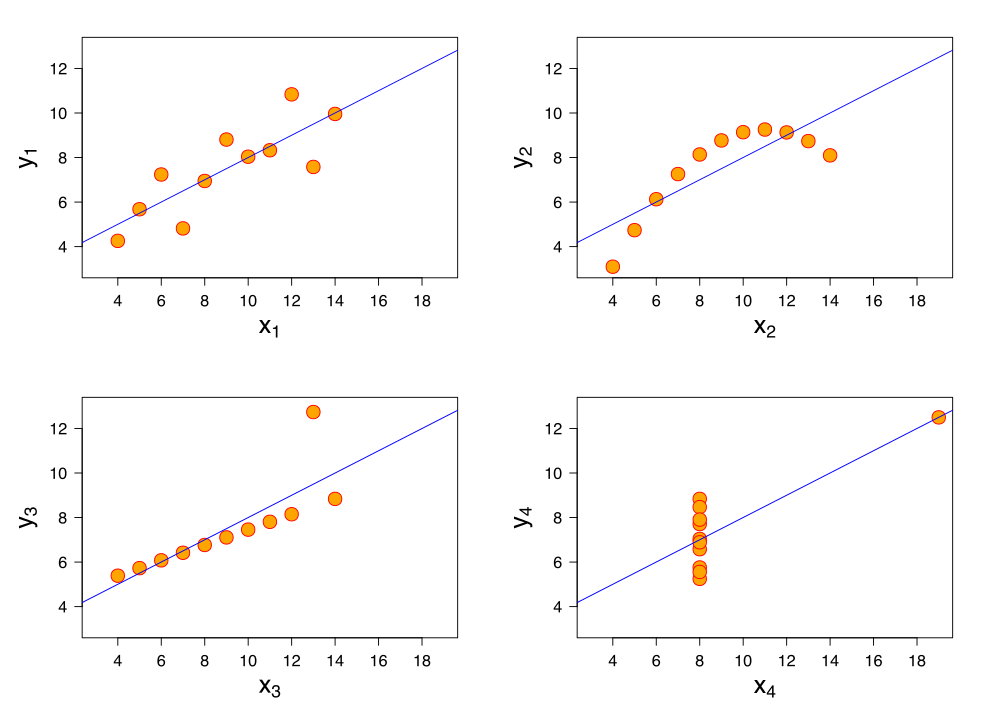

## Statistics is the science of $\ldots$ 
<br>

* distilling a lot of numbers into a few numbers.

# mean

## Just Average

* Why do we care about the mean?
	- Because sorting is $O(n\,log\,n)$?
	- Tells us something useful?

* But when does it tell us something useful?
	- When data are symmetrically distributed around it
	- When lots of points are close to it

* When you show people the mean, that is what they picture

* If the assumptions don't hold
	- We misinform people

* The fixes are obvious
	- Show a different number, e.g., median
	- Or, perhaps, one number is not enough. Show different percentiles?

## Lesson

* Formulas tell us something useful to the extent the assumptions hold
* Know the assumptions behind the formulas.

## Far From the Mean

* How far away is a point from the mean?
	- $(x - \bar{x})$

* How far away from the mean are points on average?
	- Let's say there are $n$ points
	- $\frac{\Sigma_1^n (x - \bar{x})}{n}$
	- Tells us about symmetry but not always proximity

* To calculate average proximity, one common cure is to square each number 
	- $\frac{\Sigma_1^n (x - \bar{x})^2}{n}$

* But why squares?
	- Add 2 units to 2, 12 units to 4. Why?

## 	

* Ok. We will take a square root.
	- $\sqrt{\frac{\Sigma_1^n (x - \bar{x})^2}{n}}$

* But the square root of the sum of squares is not the same as the average absolute value 

	```{r}
		sqrt(sum((seq(1, 5, 1) - 3)^2)/5)
		sum(abs(seq(1, 5, 1) - 3)/5)
	```

# go together

## Meaning

* When $x$ is large, is $y$ large too?

* When $x$ is 1, is $y$ more likely to be 1 than when $x$ is 0?

* When $x$ is larger, is $y$ is larger too? 
	* Restatement: As $x$ increases, does $y$ increase too?
	* On average

* Proportion of local changes that are in the same direction
	```{r}
		x = c(100, 200, 300, 400, 500, 600)
		y = c(1, 2, 3, 4, 5, -17000)
		mean(diff(x) > 0 & diff(y) > 0)
	```

## Dummy Correlation 

* When $x$ is above average, $y$ is above average
	- Dichotomize. Quadrant Count Ratio.

* Continuous version:
	- $\Sigma_1^n (x - \bar{x}) (y - \bar{y})$
	- If you are below the mean, I am below the mean, a positive number

* Let's try this out. 
	- 100, 200, 300, 400, 500
	- 1, 2, 3, 4, 5

*	
	```{r}
	  x = seq(100, 500, 100) - 300
      y = seq(1, 5, 1) - 3
      num = sum(x*y)
      num
	```

## Normalize

* Normalizing constant
	- $\sqrt{\Sigma_1^n (x - \bar{x})^2 \Sigma_1^n (y - \bar{y})^2}$
	- Converting $x$ and $y$ into $z$ scores
	-  
		```{r}
	  	x = sum((seq(100, 500, 100) - 300)^2)
      	y = sum((seq(1, 5, 1) - 3)^2)
      	den = sqrt(x*y)
		den
		```
	- Correlation:
		```{r}
			num/den
		```

## Normalize with the lowest value

* What if we subtract 100 and 1?

*	
	```{r}
	  x = seq(100, 500, 100) - 100
      y = seq(1, 5, 1) - 1
      sum(x*y)
	```

*  
   ```{r}
	  	x = sum((seq(100, 500, 100) - 100)^2)
      	y = sum((seq(1, 5, 1) - 1)^2)
      	sqrt(x*y)
	```

## Linear Relation

* Let's add a big jump
	```{r}
		x = c(100, 200, 300, 400, 500, 600)
		y = c(1, 2, 3, 4, 5, 17000)
	```

* 
	```{r}
   		cor(x[1:5], y[1:5])
	```

* 
	```{r}
		cor(x, y)
	```

## Linear Relation

* Let's add a big drop
	```{r}
		x = c(100, 200, 300, 400, 500, 600)
		y = c(1, 2, 3, 4, 5, -17000)
	```

* 
	```{r}
		cor(x, y)
	```

## Rank

* Same order?
	```{r}
		x = c(100, 200, 300, 400, 500, 600)
		y = c(1, 2, 3, 4, 5, 17000)
		cor(x, y, method = "spearman")
	```

* | bangles | hoops   | delta_bangles | delta_hoops| rank_bangles | rank_hoops |
  |---------|---------|---------------|------------|--------------|------------|
  | 10      | 500     |  1            | 0          |   1          |      1     |
  | 9       | 500     |  1            | 0          |   2          |      1     |
  | 8       | 500     |  1            | 250        |   3          |      1     |
  | 7       | 250     |  1            | 50         |   4          |      3     |
  | 6       | 200     |  NA           | NA         |   5          |      2     |

* Rank $x$s and $y$s
	- Kendall's $\tau$ --- concordant pairs
	- Spearman's $\rho$ --- Diff. in ranks

## Anscombe's Quartet



## Lessons

* Pearson's correlation works when the relationship is linear
* And the data aren't skewed
* Sometimes you need more than one number to describe a relationship

# Linear Regression

## Intiutions

* Temperature and ice-cream sales
	- *same* temperature ($x=$ 40&deg;C) but sales vary (multiple $y$)

* What is a function?
	- For each $x$ there is just one $y$

* For the $same$ temperature:
	- predict the mean

* You have data on 40&deg;C and 41&deg;C but not 40.4&deg;C
	- Learn from your neighbors
	- Linear interpolation of means
	- $y_{40.4} = .6*x_{40} + .4*x_{41}$

* Learning from neighbors even when you have data

* Can't beat the local mean
	- Bayes Optimal Error

* With sparsity, multiple dimensions
	- Smoothness

## Linear Regression

* We assume that the function is linear
	- It is a line. $y = f(x) = a + b*x$

* But how we find the *best fitting* line?
	- But what does that mean?
	- Line that minimizes squared errors in $y$: $(y - \hat{y})^2$
	- But why do we care about squared errors?
	- No theoretical reason---only a computational one

* But useful to check if linearity is a good assumption
	- Does it fit the data well?
	- Are the errors huge?
	- Are the errors huge in one place and small in other places?
