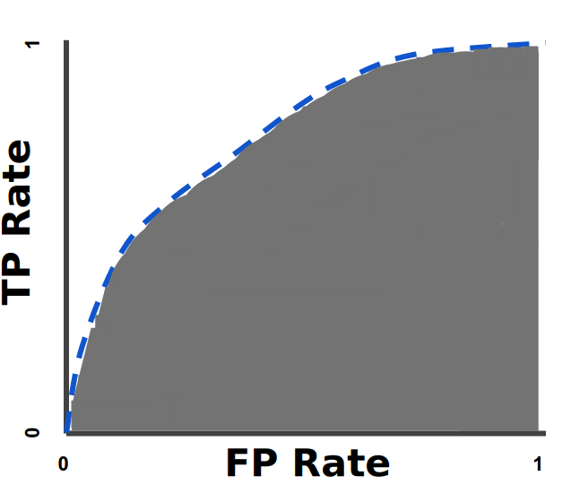

## ML Recipe

<ul>
<li class = "fragment"> Specify the quantity of interest</li>
<li class = "fragment"> Specify the cost function</li>
<li class = "fragment"> Find the lowest price on the market</li>
  <ul>
  <li class = "fragment"> Specify a model</li>
  <li class = "fragment"> Find the global optima</li>
  <ul>
    <li class = "fragment"> Test set performance</li>
  </ul>
  <li class = "fragment"> Find the model with the best test set performance</li>
</ul>

# Metrics

## $R^2$

* Fraction of Unexplained Variance
  * ${SS_{\text{tot}}} = \Sigma_i (y_i - \bar{y})^2$
  * ${SS_{\text{res}}} = \Sigma_i (y_i - f_i)^2 = \Sigma_i e_i^2$
  * $R^2 = 1 - \frac{SS_{\text{res}}}{SS_{\text{tot}}}$
  * In linear regression with intercept: $R^2 = cor(y, \hat{y})^2$

* Alternate Definition
  * $R^2 = \frac{(\Sigma_i \hat{y_i} - \bar{\hat{y_i}})^2}{SS_{\text{tot}}}$

* $\text{Aa(R)gh!!}^2$

  * Large correlation doesn't mean small MSE
  
  * $R^2$ is *weakly increasing* with the number of regressors in training data

## Using $R^2$

* Adjusted $R^2$
  * $1 - (1 - R^2)\frac{n - 1}{n - p - 1}$

* To compare models:
  * $F = \frac{\frac{\text{RSS}_1 - \text{RSS}_2}{p_2 - p_1}}{\frac{\text{RSS}_2}{n - p_{2}}}$
  * where $p$ = number of parameters and $n$ = number of rows
  * F distribution with $p_2 - p_1, n - p_2$ df
  * Ideally OOS

## Deviance

* Generalized $R^2 = \frac{\text{Deviance of Fitted Model}}{\text{Deviance of Null Model}}$
* AIC
  * $2k - 2ln(\hat{L})$ where $k$ is number of params.
  * $\sim$ Out of sample Deviance
  * Overfits in high dimensions ($k \sim n$).
  * AICc = $\text{Deviance} + 2*\text{df}*\frac{n}{n - df - 1}$
* BIC
  * $\text{Deviance} + \text{df}*log(n)$
  * BIC underfits when large $n$.

## Confusion About Confusion Matrices

* Given model, produce confusion matrix
  - and reason about precision, recall, etc.

* This gets it backwards

* Most classification models output a continuous variable: estimated probability

* And for the same model, you can build multiple decision rules that give different confusion matrices.

## ROC

 
Source: Google

* For the same model,

## AUC 

 
Source: Google

* Probability that any randomly chosen 1 has a higher score than a randomly chosen 0
  - Rank not euclidean distance

## Confusion Matrix

Pred --->

 &nbsp; | 0  | 1 |
--|----|---|
0 | TN | FP|
1 | FN | TP|

## Metrics

* Accuracy:   $\frac{TP + TN}{TP + TN + FP + FN}$ 

* Sensitivity, TPR: $\frac{TP}{TP + FN}$
* Specificity, FPR: $\frac{TN}{FP + TN}$

* Precision: fraction of retrieved instances that are relevant 
             $\frac{TP}{TP + FP}$

* Recall: fraction of relevant instances that are retrieved 
               $\frac{TP}{TP + FN}$ 

## Quiz for Comprehension

 &nbsp; | 0  | 1 |
--|----|---|
0 | 78 | 10|
1 | 7  | 5 |

## Answers

* Accuracy = 83%
* Precision = 33%
* Recall = 41%
* F1 Score = 37%

## Dealing with Skew

* Track precision and recall 
* $F_1$:
  * harmonic mean
    - $\frac{2}{\frac{1}{p} + \frac{1}{r}}$
  * $2\frac{\text{precision*recall}}{\text{precision + recall}}$ 
* $F_\beta$: 
  * $\beta$ captures how important recall is vis-a-vis precision
  * $(1 + \beta^2) \frac{\text{precision*recall}}{\beta^2\text{precision + recall}}$ 

## OOS

* Rule: Don't look at the test data *too often*
  * Say we want to choose the degree of polynomial but use test error to pick the model, we would have an optimistic assessment of its performance.
  * Train/Dev/Test

* How to construct OOS
  * Distribution:
    * Dev and test set should come from the same distribution
    * choose dev set and test set to reflect data you expect to get in the future and consider important to do well on
  
  * Size
    * Test set has to be big enough to give you a good estimate of performance
    * Small data and lots of features: 60/20/20
    * Big Data: 95/2.5/2.5 

## Satisficing Metric and Optimizing Metric

* Satisficing metrics: 
  * $\sim$ Constraints
  * Examples:
    * Maximize accuracy subject to running time $<= 100ms$
    * Alexa: Maximize accuracy subject to the constraint that FPR is 1 FP per 24 hrs

* Regularization
  * MinDiff $\sim$ Equalize error rates across groups.
  * Source: <a href = "https://arxiv.org/pdf/1910.11779.pdf">Google; Proust et al. 2019</a>

## Diagnosing Bias/Variance

* Bias problem (underfitting): 
  * train error is high. 
  * **validation error is similar but a bit more than train.**

* Variance problem (overfitting): 
  * train error is low. 
  * **validation error is much higher than train.**
    * Get more data
    * Regularization
