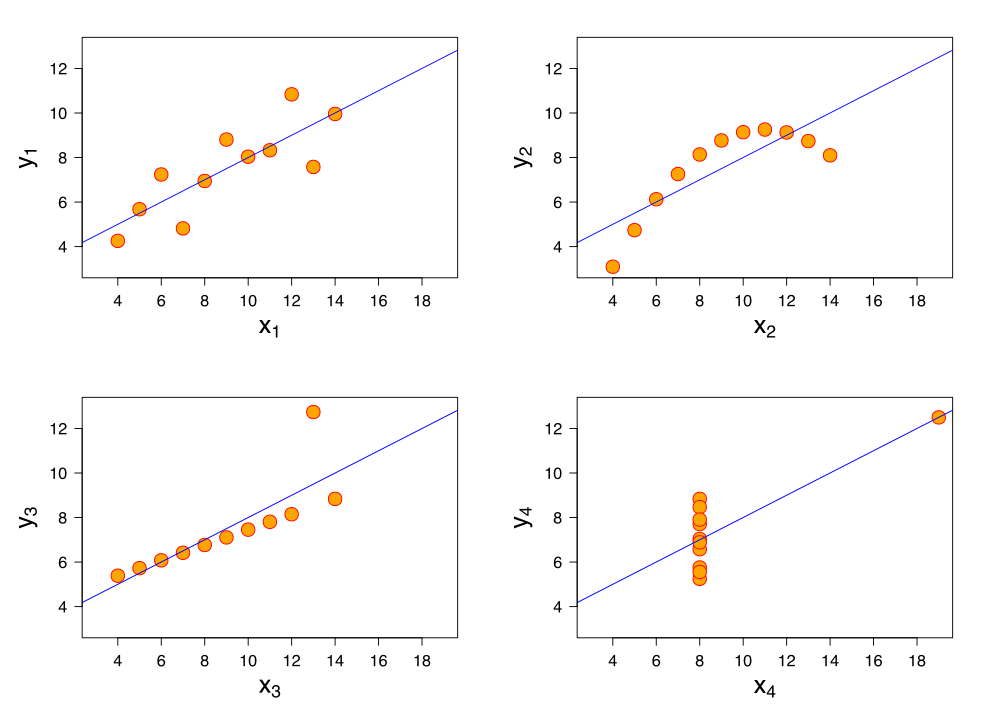

# cosal inference

## Casual Inference

* Five Habits of Successful People
	- Adopt these and you will be successful too!

* More frequent system crashes *cause* people to renew their software license.  

* I took this homeopathic medication and my headache went away!

* Mayor Giuliani brought the NYC crime rate down.

## Sins

* Selecting on the dependent variable
	- Think about counterfactuals!

* Mistaking correlation for causation
	- No causation without manipulation

* Not accounting for placebo effects

* Treating temporally proximate as causal

* In everyday conversation, people frequently make two other errors:
	- $x$ always causes $y$
	- $x$ causes $y$ to change a lot

# mean

## Average, Above Average, Below Average

* Why (When) do we care about the mean?
	- Sorting is $O(n log n)$
	- When data are symmetrically distributed around it
	- When lots of points are close to it

* How far away is a point from the mean?
	- $(x - \bar{x})$

* How far away from the mean are points on average?
	- Let's say there are $n$ points
	- If we just care about the distance, not direction
	- $\frac{\Sigma_1^n (x - \bar{x})^2}{n}$

## Far From the Mean

* But why squares?
	- Add 2 units to 2, 12 units to 4. Why?

* Ok. We will take a square root.
	- $\sqrt{\frac{\Sigma_1^n (x - \bar{x})^2}{n}}$

* Square root of sum of squares and absolute values

	```{r}
		sqrt(sum((seq(1, 5, 1) - 3)^2)/5)
		sqrt(sum(abs(seq(1, 5, 1) - 3))/5)
	```

# go together

## Meaning

* When $x$ is large, is $y$ large too?
	- What does that mean?

* When $x$ is 1, is $y$ more likely to be 1 than when $x$ is 0?

* As $x$ increases, does $y$ increase too?
	- On average

* How do you capture that intuition?

* Rank $x$s and $y$s
	- Spearman --- Diff. in ranks
	- Kendall --- concordant pairs
 
## Intuitions we understand


* When $x$ is above average, $y$ is above average
	- Dichotomize. Quadrant Count Ratio.

* Proportion of local changes that are in the same direction
	```{r}
		x = c(100, 200, 300, 400, 500, 600)
		y = c(1, 2, 3, 4, 5, -17000)
		mean(diff(x) > 0 & diff(y) > 0)
	```

* Average of local changes
	```{r}
		x = c(100, 200, 300, 400, 500, 600)
		y = c(1, 2, 3, 4, 5, -17000)
		mean(c(1/100, 1/100, 1/100, 1/100, -17001/100))
	```

## Correlation 

* For each $x$, $y$, calculate how far it is from its mean

* Then multiply:
	- $\Sigma_1^n (x - \bar{x}) (y - \bar{y})$
	- If you are below the mean, I am below the mean, a positive number

* Let's try this out. 
	- 100, 200, 300, 400, 500
	- 1, 2, 3, 4, 5

*	
	```{r}
	  x = seq(100, 500, 100) - 300
      y = seq(1, 5, 1) - 3
      sum(x*y)
	```

* What do you do with that?

## Normalization

* Normalizing constant
	- $\sqrt{\Sigma_1^n (x - \bar{x})^2 \Sigma_1^n (y - \bar{y})^2}$
	-  
		```{r}
	  	x = sum((seq(100, 500, 100) - 300)^2)
      	y = sum((seq(1, 5, 1) - 3)^2)
      	sqrt(x*y)
		```

* What if we subtract 100 and 1?

	```{r}
	  x = seq(100, 500, 100) - 100
      y = seq(1, 5, 1) - 1
      sum(x*y)
	```

	```{r}
	  	x = sum((seq(100, 500, 100) - 100)^2)
      	y = sum((seq(1, 5, 1) - 1)^2)
      	sqrt(x*y)
	```

## Linear Relation

* Let's add a big jump
	```{r}
		x = c(100, 200, 300, 400, 500, 600)
		y = c(1, 2, 3, 4, 5, 17000)
		cor(x[1:5], y[1:5])
		cor(x, y)
	```

* Same order?
	```{r}
	 cor(x, y, method = "spearman")
	```

## Linear Relation

* Let's add a big drop
	```{r}
		x = c(100, 200, 300, 400, 500, 600)
		y = c(1, 2, 3, 4, 5, -17000)
		cor(x, y)
	```

* Same order?
	```{r}
	 cor(x, y, method = "spearman")
	```

## Anscombe's Quartet



# Linear Regression

## Intiutions

* Temperature and ice-cream sales
	- *same* temperature ($x=$ 40&deg;C) but sales vary (multiple $y$)

* What is a function?
	- For each $x$ there is just one $y$

* For the $same$ temperature:
	- predict the mean

* You have data on 40&deg;C and 41&deg;C but not 40.4&deg;C
	- Learn from your neighbors
	- Linear interpolation of means
	- $y_{40.4} = .6*x_{40} + .4*x_{41}$

* Can't beat the local mean
	- Bayes Optimal Error

* With sparsity, multiple dimensions
	- Smoothness

## Linear Regression

* We assume that the function is linear
	- It is a line. $y = f(x) = a + b*x$

* But how we find the *best fitting* line?
	- But what does that mean?
	- Line that minimizes squared errors in $y$: $(y - \hat{y})^2$
	- But why do we care about squared errors?
	- No theoretical reason---only a computational one

* But useful to check if linearity is a good assumption
	- Does it fit the data well?
	- Are the errors huge?
	- Are the errors huge in one place and small in other places?
